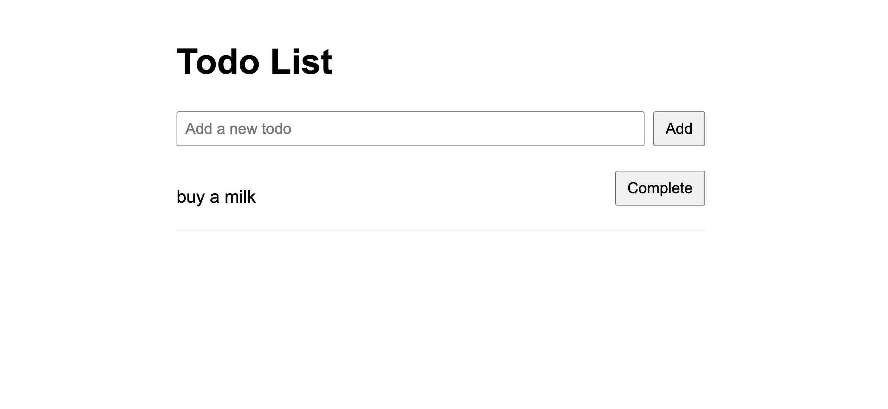
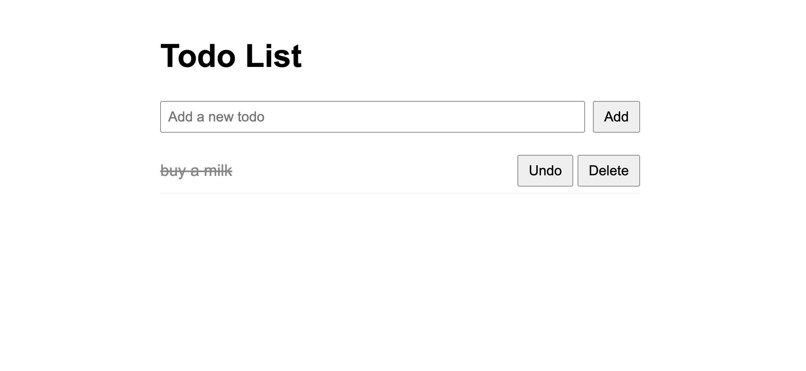
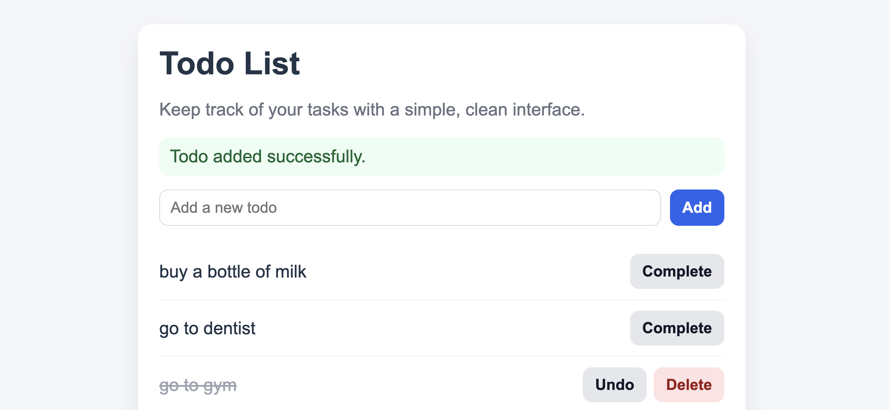

Prompt 1.
I need to build a simple Laravel To-Do application. Guide me through creating a new Laravel project using Composer, configuring SQLite as the database, and starting the development server.

AI response.
The new Laravel project has been created in your workspace and configured to use SQLite.
What I completed
Scaffolded a Laravel app with Composer in your workspace.
Updated .env to use SQLite.
Created the SQLite database file at database.sqlite.
Verified the database setup by running php artisan migrate successfully.
Started the development server at:
http://127.0.0.1:8000

Prompt 2.
Create a Laravel migration for a `todos` table. Each to-do should have:
- id
- title (string)
- completed (boolean, default false)
- timestamps

AI response.
Migration created successfully
The todos table migration has been added and applied.
Schema included
id
title (string)
completed (boolean, default false)
created_at / updated_at timestamps
File created.

Prompt 3.
Generate the Laravel model for the Todo table and configure the `$fillable` property correctly.

AI response.
The Laravel model has been generated and configured with the correct fillable fields.
Updated file: Todo.php
Fillable fields: title, completed.

Prompt 4
Create a Laravel resource controller for a Todo application. I only need methods to:
display all todos
store a new todo
mark a todo as completed
AI response.
Todo controller created
The controller now contains the three requested actions:
index: display all todos
store: create a new todo
complete: mark a todo as completed

Prompt 5.
Generate the Laravel web routes needed for this To-Do application using the controller.

AI response.
Routes added. The web routes for the Todo app are now configured in web.php:
GET / → list todos
POST /todos → create a new todo
PATCH /todos/{todo}/complete → mark a todo as completed

Prompt 6.
Create a simple Blade page that:
displays a form for adding a new todo
lists all existing todos
shows completed items with a line-through style
includes a button to mark incomplete items as completed
AI response.
A simple Todo UI is now available at:
http://127.0.0.1:8000
What it includes:
A form to add a new todo
A list of all existing todos
Completed items shown with a line-through style
A button to mark incomplete items as completed
Files added/updated
index.blade.php
TodoController.php
StoreTodoRequest.php

Worked on the first try.

**Screenshot**

Prompt 7.
Add Laravel validation so the todo title is required and has a maximum length of 255 characters.

AI response.
Validation added
The todo title validation is already configured in StoreTodoRequest.php with these rules:
required
string
max:255

Prompt 8.
Add delete button for completed todos.

AI response.
Completed. A delete button now appears for completed todos, and it removes the item through the new delete route.
Updated
TodoController.php
web.php
index.blade.php

Prompt 9.
Also add an undo button if I accidentally touched the completed button.

**Screenshot**

AI response.
Undo button added
Completed todos now show an Undo button so they can be marked incomplete again.
Updated files
TodoController.php
web.php
index.blade.php

Prompt 10.
Improve the appearance of the todo list using Bootstrap or simple CSS while keeping the application minimal.

AI response.
UI refreshed
The Todo page now has a cleaner, minimal card-style look with:
better spacing and layout
a polished form for adding todos
clearer action buttons for Complete, Undo, and Delete
a subtle completed-item style
Updated file: index.blade.php

**Screenshot**

Prompt 11.
Add step-by-step instructions to run the project locally in README.md file.

AI response.
README.md created
I've added comprehensive step-by-step instructions to README.md that cover:

Features — Overview of the todo app functionality
Prerequisites — PHP, Composer, Git requirements
Installation — 6 clear steps to set up the project
Running — How to start the dev server
Usage — Instructions on using the app
Project Structure — Directory layout
Routes — Available API endpoints
Troubleshooting — Common issues and solutions